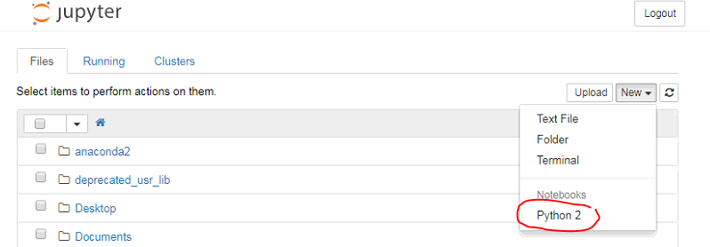
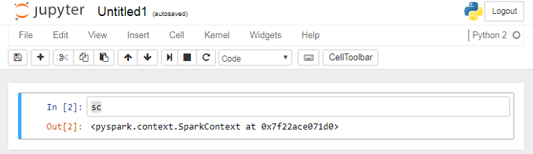

MSBA 6330 Prof Liu

Last revision: 2017-10-29

# Install Spark Updates on the VM


<!-- MarkdownTOC autolink="true" bracket="round"-->

- [Step 1: Download these datasets/scripts into your vagrant folder](#step-1-download-these-datasetsscripts-into-your-vagrant-folder)
- [Step 2: Update your vagrant folder](#step-2-update-your-vagrant-folder)
- [Step 3: Reboot your vagrant machine](#step-3-reboot-your-vagrant-machine)
- [Step 4: Start and Test PySpark](#step-4-start-and-test-pyspark)
- [Step 5: Test/Bookmark Other Forwarded Services](#step-5-testbookmark-other-forwarded-services)

<!-- /MarkdownTOC -->

## Step 1: Download these datasets/scripts into your vagrant folder

**Download** the following files from Google Drive and save them in your **vagrant folder**.

- [Anaconda2-4.3.1-Linux-x86_64.sh](https://drive.google.com/open?id=0BxsgolIYy2-JSW5lbnRscU1aZ0k): Script to Install Anaconda2 (python 2.7) with Jupyter Notebook (462 MB)
- [data-spark.tar.gz](https://drive.google.com/open?id=0BxsgolIYy2-JM1QyZHFhTURSVU0): some data sets (169 MB)
- [dev1-spark.tar.gz](https://drive.google.com/open?id=0BxsgolIYy2-JcENTbkVaRUFxdEE): some other sample data (305 kB)
- [loudacre.sql](https://drive.google.com/open?id=0BxsgolIYy2-JN1hjam9LXzZnbkE): loudacre database (154 MB)

## Step 2: Update your vagrant folder

In the command line, from your **vagrant folder**, run:

```shell
git pull  # to pull the latest update to vagrant file.
```

## Step 3: Reboot your vagrant machine

In the command line, from your **vagrant folder**, run:

```shell
vagrant halt
vagrant up # this should take a long time and show a ton of updates (3-5 mins)
vagrant provision # if the above command does not apply updates run this command
```
> **Note**: This time, we need to reboot the VM because we need to set up the port forwarding. This update may take some time as it takes a while to install annaconda2.

## Step 4: Start and Test PySpark

SSH into your VM. Then type at the terminal:

```
pyspark
```

As PySpark starts, you should see something like this among the messages:

```
[C 22:17:39.187 NotebookApp]
  Copy/paste this URL into your browser when you connect for the first time,
  to login with a token:
  http://0.0.0.0:8889/?token=b6c8cf698647fc953d932860b86bf3a42f3xx2xxxf15
```

**Copy the url** and paste in your host computer's brwoser, and **change "0.0.0.0" to "localhost"**, e.g. `http://localhost:8889/?token=b6c8cf698647fc953d932860b86bf3a42f3xx2xxxf15`

This should allow you to access PySpark in a Jupyter Notebook environment from your browser.



Create a new **Python 2** (PySpark) notebook as seen in the above. 

Wait until the PySpark kernel is ready, as indicated by **a white circle next to Python 2** (a black circle means that the kernel is busy). 

Then type `sc` in the first cell, hit <kbd>Ctrl+Enter</kbd> to run the cell. If you see a response similar to below, you have successfully started the PySpark.



## Step 5: Test/Bookmark Other Forwarded Services

We have forwarded other services so that you can use your browser to access VM without needing the VM's own GUI.

- http://localhost:8889 -- PySpark web services (the one we used above)
- http://localhost:8888 -- Hue Web UI.
- http://localhost:18088 -- Spark History Server (for you to inspect completed spark jobs).
- http://localhost:4040 -- Spark Job Monitor (for you to monitor ongoing spark jobs, not available if you're not running any spark job). It may also use 4041/4042 port. 

It may be a good idea to **bookmark these** for later use.

In the future labs, you'll have a chance to learn to use PySpark in a Notebook environment.

<!-- ## Going Back to Hive
You may want to go back to just having the hive version of the box. To do this run the following in terminal:

```
vagrant destroy
git fetch origin # if this is your first time running this
git checkout hive-only 
vagrant up
```
If you want to then go back to spark simply run:

```
vagrant destroy
git checkout master 
vagrant up
```
-->
