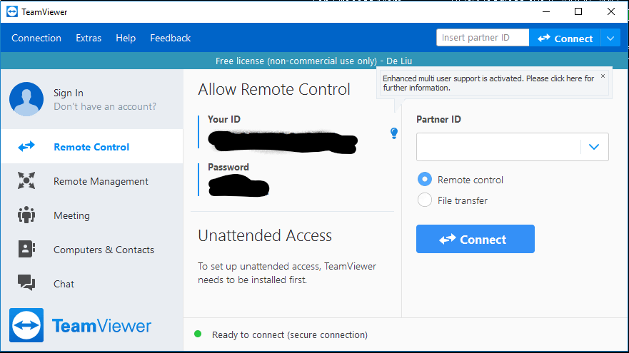

# Install team Viewer to enable remote assistance.

In rare cases, you may need the instructor to log on to your MSBA virtual desktop to diagnose/address issues. An easy way to do that is via Teamviewer. 

1. Download [Teamviewer](https://www.teamviewer.com/en-us/) from the Internet.
2. Run it (choose personal license, run it once is fine)
3. Share the (temporary) ID/password with the instructor to allow remote control. 

