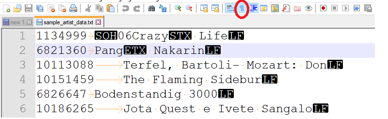
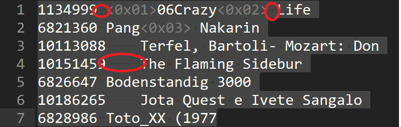
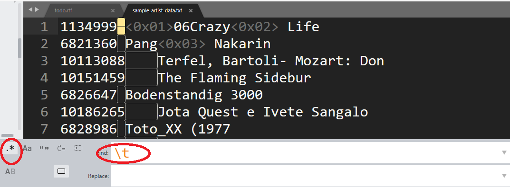

# How to View Delimiters & invisible characters

Often time you need to know whether a while space is a tab or space, and whether an invisible character has been used as delimiters.

## In linux:

You can use `cat -t` including (`cat -t | head`) to show invisible characters

e.g.:

**`cat -t sample_artist_data.txt | head`**

```
1134999^I^A06Crazy^B Life
6821360^IPang^C Nakarin
10113088^ITerfel, Bartoli- Mozart: Don
10151459^IThe Flaming Sidebur
6826647^IBodenstandig 3000
```
where 
- `^I`: tab (`\t`)
- `^A`: control-A (`\001`)
- `^B`: control-B (`\002`)
- `^C`: control-C (`\003`)

In windows, with Notepad++, turn on the "Show All Characters" (menu> view > show symbol > show all characters) 



In sublime, if you select text, it will show invisible characters including space and tab.



Additionally, you may use regex search (`\t`, `\n`, `\r`,`\001` etc) to highlight special characters.

